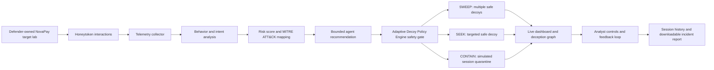

# PikaTrap

> **Adaptive deception. Intelligent defense.**

PikaTrap is a working, defender-owned cyber-deception platform built by **Team Pikachu** for the **Neurobots National Level Hackathon 2026**.

It safely simulates attacker behavior against fictional NovaPay assets. When a simulated attacker interacts with honeytokens, PikaTrap collects telemetry, calculates risk for that action, infers likely intent, maps the behavior to MITRE ATT&CK, selects an adaptive deception policy, visualizes the observed path, and generates an incident report.

> **Safety boundary:** All files, credentials, services, identities, and data shown by PikaTrap are fictional. The platform does not scan, access, attack, or modify real external systems.

---

## Team

| Item | Details |
|---|---|
| Team Name | Team Pikachu |
| Members | Abellash, Antony |
| Domain | Defensive Cybersecurity |
| College | Sahrdaya College |
| Project | PikaTrap — Adaptive Deception Intelligence Platform |

---

## Problem Statement

Security teams often discover credential theft, cloud reconnaissance, source-code discovery, or sensitive-data collection only after an attacker has already reached valuable assets.

Traditional security alerts can also be difficult to prioritize because one isolated event does not explain the attacker’s overall goal.

PikaTrap addresses this by using realistic but fictional decoys to answer:

- What did the attacker interact with?
- What is the likely attacker intent?
- Which MITRE ATT&CK technique matches the behavior?
- How risky was that individual action?
- Should the defender observe, deploy more decoys, or contain the session?

---

## Proposed Solution

PikaTrap is a safe adaptive deception environment.

A simulated attacker interacts with the NovaPay target lab. Each interaction creates telemetry. PikaTrap analyzes the observed sequence and selects a safe response:

- **OBSERVE** — continue collecting evidence
- **SWEEP** — place several safe metadata decoys after broad reconnaissance
- **SEEK** — place one targeted decoy after focused behavior
- **CONTAIN** — quarantine the simulated session after high-risk collection behavior

The dashboard shows the live deception graph, telemetry feed, per-action risk, intent, MITRE ATT&CK mapping, policy decision, completed-session history, and downloadable report.

PikaTrap also records controlled-lab deception outcomes and gives an analyst a final, visible decision point before a manual sandbox quarantine.

---

## Key Features

### Honeytoken Generation

PikaTrap includes fictional decoys such as:

- `.env` production configuration file
- AWS-style honeycredentials
- Database backup credentials
- Customer export document
- Source-code deployment key
- Fake cloud-storage routes
- Fake internal services
- Fake authentication and operations pages

### Multi-step Attacker Simulation

The NovaPay lab supports multiple attacker choices and branching paths, including:

- Broad reconnaissance
- Configuration-file discovery
- Cloud credential exploration
- Database backup exploration
- Source-code secret discovery
- Customer-export collection attempt
- Fake service navigation

### Real-time Telemetry Collection

Every interaction creates a safe telemetry event containing:

- Session identifier
- Event time
- Simulated asset accessed
- Attacker behavior type
- Per-action risk score
- Inferred intent
- MITRE ATT&CK mapping
- Adaptive policy decision
- Containment status

### Explainable Intent Analysis

PikaTrap uses explainable, rule-based behavior analysis to infer possible attacker intentions:

- Reconnaissance
- Credential access
- Cloud access
- Source-code discovery
- Database access
- Collection
- Possible exfiltration behavior

> The current version does not claim a trained autonomous LLM. Its decisions are transparent, deterministic, and based on observed behavior patterns.

### MITRE ATT&CK Mapping

| Simulated action | Example ATT&CK context |
|---|---|
| Reading a fake `.env` file | T1552.001 — Credentials In Files |
| Accessing fake cloud credentials | Credential / cloud-access discovery behavior |
| Discovering a source-code deployment key | Credentials In Files |
| Opening customer export data | Collection behavior |
| Attempting export | Exfiltration-related behavior |

### Per-action Risk Score

PikaTrap scores each action separately instead of relying only on one permanent global score.

This makes it easier to explain:

- Which event created risk
- Why the event is important
- How the attacker path changed
- When containment became necessary

### Adaptive Decoy Policy Engine

#### SWEEP

Used after broad reconnaissance.

PikaTrap creates several metadata-only decoys in the safe sandbox to increase deceptive coverage.

```text
Observed behavior: broad reconnaissance
Decision: SWEEP
Response: deploy multiple safe metadata decoys
```

#### SEEK

Used after focused behavior such as credential, source-code, cloud, or service discovery.

PikaTrap creates one relevant targeted decoy.

```text
Observed behavior: focused credential discovery
Decision: SEEK
Response: deploy one targeted safe decoy
```

#### CONTAIN

Used after high-risk collection behavior.

```text
Observed behavior: customer export or high-value collection attempt
Decision: CONTAIN
Response:
- mark simulated session as quarantined
- revoke fictional credentials for that session
- preserve evidence for incident reporting
```

### Live Deception Graph

The dashboard builds a live graph from actions that have already occurred.

It displays:

- Observed attacker path
- Decoys encountered
- Event risk
- Inferred intent
- MITRE ATT&CK mapping
- SWEEP, SEEK, or CONTAIN decision

PikaTrap does not reveal future attack paths before a user chooses the next simulated action.

### Incident Reports and History

When a session is completed or contained, it is stored in session history.

The downloadable incident report includes:

- Session details
- Telemetry timeline
- Attacker actions
- Per-action risk
- Inferred intent
- MITRE ATT&CK mapping
- Deception graph
- Adaptive policy decisions
- Bounded agent recommendation and deterministic safety-gate result
- Decoy feedback outcome: ignored, engaged, or engaged with progression
- Analyst decision audit entries
- Containment outcome

### Human-in-the-loop SOC Controls

The dashboard includes a safe analyst-control panel for an active NovaPay sandbox session:

- **Approve** records acceptance of the current recommendation
- **Reject** records that the analyst declined it
- **Override** records an analyst alternative for later review
- **Quarantine** immediately isolates only the fictional sandbox session and revokes its fictional credential access

Every choice is stored in a session audit trail. This is a local demonstration of analyst oversight, not an enterprise authentication or RBAC system.

### Deception Feedback and Effectiveness Analytics

After a contained session, PikaTrap evaluates whether controlled-lab decoys were:

- Ignored
- Engaged
- Engaged and followed by further attacker progression

The feedback loop uses these outcomes to prefer stronger previously effective safe decoys in later placement decisions. The dashboard shows decoys evaluated, engagement rate, ignored outcomes, progressed outcomes, and completed sessions.

---

## Technical Architecture



### System Components

| Component | Role |
|---|---|
| NovaPay target lab | Safe fictional attacker-facing website |
| Honeytoken catalog | Provides fake credentials, files, services, and documents |
| FastAPI backend | Receives telemetry and applies risk, intent, and policy logic |
| PostgreSQL | Stores events, sessions, incidents, and reports |
| Redis | Supports service communication and real-time behavior |
| React dashboard | Displays telemetry, maps, risk, policy, and reports |
| Adaptive Decoy Policy Engine | Selects SWEEP, SEEK, OBSERVE, or CONTAIN |
| Bounded agentic orchestrator | Makes an explainable recommendation from a restricted safe action set |
| Deterministic safety gate | Applies the final safe policy decision |
| Analyst controls | Records approve, reject, override, and sandbox-quarantine decisions |
| Feedback service | Records decoy engagement outcomes and informs future safe placement |
| Docker Compose | Runs the local multi-service application |
| Railway | Hosts deployed demo services |

---

## Technology Stack

| Layer | Technology |
|---|---|
| Frontend | React, TypeScript, Vite |
| Backend | Python, FastAPI |
| Database | PostgreSQL |
| Cache / Messaging | Redis |
| Real-time Updates | WebSocket |
| Containerization | Docker, Docker Compose |
| Deployment | Railway |
| Target Simulation | NovaPay safe target lab |
| Version Control | Git and GitHub |

---

## Project Structure

```text
pikatrap/
├── backend/                # FastAPI API, telemetry and policy logic
├── frontend/               # React dashboard
├── lab/                    # NovaPay safe target lab
├── deception/              # Fictional honeytokens and decoy materials
├── docs/                   # Architecture, API, and demo documentation
├── docker-compose.yml      # Local multi-container setup
├── .env.example            # Environment variable template
└── README.md
```

---

## Run Locally

### Prerequisites

Install:

- Docker Desktop
- WSL 2, if Docker Desktop asks for it on Windows
- Git, optional but recommended

### Start the Application

Open PowerShell in the project folder:

```powershell
cd "C:\Users\anton\OneDrive\Documents\ChatGPT\pikatrap"
Copy-Item .env.example .env
docker compose up --build
```

Open these URLs:

| Service | URL |
|---|---|
| PikaTrap dashboard | http://localhost:5173 |
| NovaPay target lab | http://localhost:8081 |
| Backend health check | http://localhost:8000/health |

### Stop the Application

```powershell
docker compose down
```

---

## Live Deployment

| Service | URL |
|---|---|
| PikaTrap Dashboard | https://frontend-production-3bd91.up.railway.app |
| NovaPay Target Lab | https://novapay-lab-production.up.railway.app |
| GitHub Repository | https://github.com/Abellash/adaptive-deception-intelligence |

---

## API Overview

| Endpoint | Purpose |
|---|---|
| `GET /health` | Backend health check |
| `POST /api/v1/telemetry` | Receive a standardized safe telemetry event |
| `POST /api/v1/demo/trigger` | Trigger a safe demo honeytoken event |
| `GET /api/v1/events` | Retrieve collected telemetry |
| `GET /api/v1/incidents` | Retrieve completed session history |
| `POST /api/v1/sessions/{session_id}/analyst-action` | Record an analyst approve, reject, override, or local quarantine decision |
| `GET /api/v1/sessions/{session_id}/analyst-decisions` | Retrieve analyst audit entries for a session |
| `GET /api/v1/sessions/{session_id}/containment` | Retrieve current sandbox containment status |
| `GET /api/v1/deception-effectiveness` | Retrieve controlled-lab decoy engagement metrics |
| `GET /api/v1/reports/{session_id}.html` | View or generate an incident report |
| `WS /ws/events` | Receive live event updates |

---

## Live Demo Guide

### 1. Start a Safe Session

1. Open the PikaTrap dashboard.
2. Click **Start attack simulation**.
3. Open the NovaPay target lab.

Explain:

> “NovaPay is a defender-owned fictional target. Every file, identity, credential, and service in this environment is safe and fake.”

### 2. Demonstrate SWEEP

1. Choose a broad reconnaissance option in NovaPay.
2. Return to the PikaTrap dashboard.
3. Show the new telemetry event and live deception graph.
4. Show the **SWEEP** policy decision.

Explain:

> “The attacker is exploring broadly. PikaTrap responds by placing multiple safe metadata decoys inside the sandbox.”

### 3. Demonstrate SEEK

1. Choose a focused credential, cloud, source-code, database, or service action.
2. Return to the dashboard.
3. Show the action risk, inferred intent, MITRE mapping, and updated graph.
4. Show the **SEEK** policy decision.

Explain:

> “The attacker is focused on a specific target. PikaTrap responds with one targeted decoy without revealing the future path.”

### 4. Demonstrate Containment

1. Continue to a customer-export or high-value collection action.
2. Show the **SESSION QUARANTINED** result in NovaPay.
3. Return to the dashboard and show the completed deception graph and telemetry.

Explain:

> “The attacker behavior crossed the collection-risk threshold. PikaTrap quarantines this simulated session and revokes fictional credentials inside the lab.”

### 5. Demonstrate Reporting

1. Open completed-session history.
2. Select the contained session.
3. Show the event timeline, graph, risk, intent, MITRE mapping, and containment result.
4. Download the incident report.

---

## Current Progress

The following capabilities are complete and demo-ready:

- [x] React dashboard
- [x] FastAPI backend
- [x] PostgreSQL and Redis services
- [x] Dockerized local deployment
- [x] Railway deployment
- [x] NovaPay safe target lab
- [x] Multiple honeytoken categories
- [x] Multi-step attacker choices
- [x] Real-time telemetry feed
- [x] Per-action risk scoring
- [x] Explainable intent analysis
- [x] MITRE ATT&CK mapping
- [x] Live deception graph
- [x] SWEEP adaptive placement
- [x] SEEK adaptive placement
- [x] Simulated sandbox containment
- [x] Fictional credential revocation
- [x] Completed-session history
- [x] Downloadable incident reports
- [x] Bounded agentic recommendation with deterministic safety gate
- [x] 24-scenario safe synthetic evaluation harness
- [x] Decoy feedback loop for ignored, engaged, and progressed outcomes
- [x] Deception effectiveness analytics dashboard
- [x] Human-in-the-loop analyst controls and session audit trail
- [x] Analyst-approved local sandbox quarantine

---

## Bounded Agentic Orchestration

The bounded agentic orchestrator reads the complete simulated session history and recommends one action from `OBSERVE`, `SWEEP`, `SEEK`, `DEPLOY_DECOY`, `ESCALATE`, or `RECOMMEND_CONTAINMENT`.

The deterministic policy remains the final safety gate: it can block containment, normalize a recommendation to a safe metadata-only placement, or override it when the containment threshold is met. The dashboard and incident report display both the recommendation and the safety-gated action. See [bounded agentic orchestrator](docs/bounded-agentic-orchestrator.md).

## Safe Synthetic Evaluation

PikaTrap includes 24 deterministic NovaPay sandbox scenarios to regression-test the current intent, MITRE mapping, placement, and containment logic. The harness reports agreement with reviewed scenario labels, containment false positives, event-count detection latency, decoy engagement, and safe-asset reachability.

Run it from the `backend` directory:

```powershell
python evaluation/run_evaluation.py
```

Reports are written to `backend/evaluation/results/`. These are synthetic regression metrics, not claims of real-world attack-detection accuracy.

## Deception Feedback Loop

When a session is contained, PikaTrap writes an explainable outcome for each relevant controlled-lab decoy: `IGNORED`, `ENGAGED`, or `ENGAGED_AND_PROGRESSED`. Placement uses this historical lab-only feedback to rank later safe decoy candidates. It is a lightweight evidence loop, not autonomous model training.

## Human-in-the-loop SOC Workflow

The bounded agent and deterministic policy can recommend a safe action, but an analyst can also record **Approve**, **Reject**, **Override**, or **Quarantine** from the dashboard. Quarantine is limited to the defender-owned NovaPay session: it changes the local session status to `CONTAINED`, creates an incident record, revokes fictional credentials, and preserves feedback for reporting.

---

## Future Scope / Final Round Roadmap

The following enhancements are planned for authorized real-world enterprise use:

- [ ] Integrate authorized endpoint, cloud, network, or SIEM telemetry
- [ ] Add user authentication, formal RBAC, and tamper-evident enterprise audit logging
- [ ] Deploy decoys into approved cloud or object-storage test environments
- [ ] Add alert integrations: email, Slack, Microsoft Teams, Jira, or ServiceNow
- [ ] Evaluate and calibrate risk and intent scoring with approved red-team datasets
- [ ] Add more authorized cloud, API, storage, and service decoys
- [ ] Pilot the platform with a security team
- [ ] Measure alert quality, usability, false positives, and detection value
- [ ] Add attack replay / forensic mode for completed deception graphs

---

## Security and Ethical Boundaries

PikaTrap is designed for defensive cybersecurity demonstration, training, and research.

The platform:

- Uses only fictional credentials, files, data, identities, and services
- Operates in a controlled defender-owned environment
- Does not scan external systems
- Does not exploit or counter-attack systems
- Does not access real customer data
- Does not claim real-world attacker attribution
- Does not claim trained autonomous AI behavior
- Simulates containment only inside the PikaTrap sandbox

---

## License

Built by Team Pikachu as a hackathon project.
